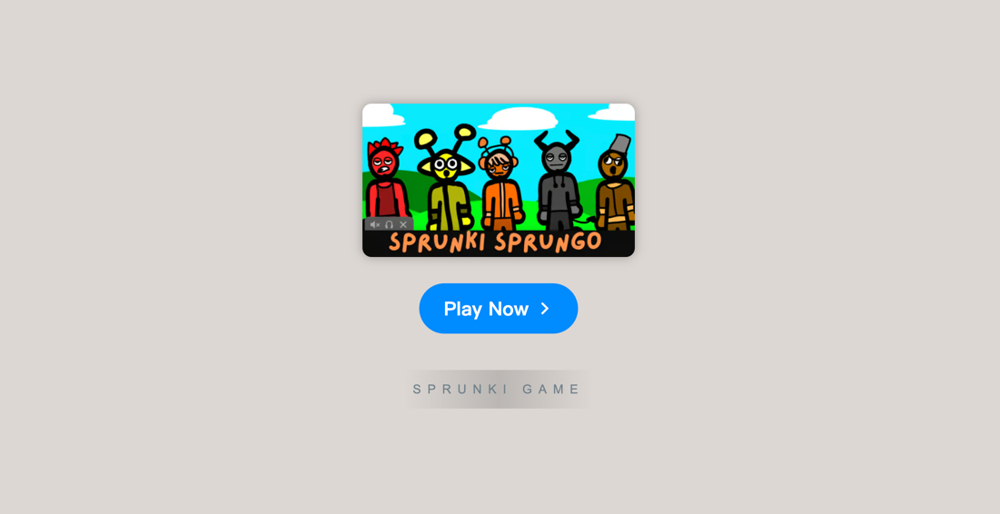

# Sprunki Pinki Bowified

    

Welcome to **[Sprunki Pinki Bowified](https://sprunkionline.com/pinki-bowified/)**, a fun and creative twist on the classic Sprunki game. This guide provides an in-depth look into the game’s features, mechanics, and phases, giving players an exciting musical adventure filled with fresh challenges and sounds. With its innovative game design and community-driven modes, Sprunki Pinki Bowified offers an engaging experience for both new and returning players.

### Table of Contents
- Introduction
- Features
- Installation
- Gameplay Overview
- Sprunki Phases
- Popular Modes & Mods
- Tips for Success
- Resources

### Introduction

**Sprunki Pinki Bowified** adds a delightful, dynamic spin to the original Sprunki formula by introducing new characters, sounds, and creative modes. Whether you're a fan of the original game or trying it out for the first time, Sprunki Pinki Bowified offers a fun way to compose unique music mixes online. It’s free to play, and you can easily dive into the world of Sprunki through your browser.

### Features

| Feature                | Description                                                                          |
|------------------------|--------------------------------------------------------------------------------------|
| **Pinki Bowified Mod** | Unleash your creativity with new character designs and an expanded range of sounds.   |
| **Incredibox Phase 3 & 4** | Enjoy enhanced versions of familiar phases, featuring fresh sound options and themes. |
| **Sprunki Infected**   | A dark, quirky mode that brings unique challenges and eerie sounds to your music mix.  |
| **Mustard Sprunki**    | A beloved character that adds a distinct flavor to your music creations.              |
| **Online Play**        | Play directly from your browser, no download needed.                                  |
| **Free Access**        | Enjoy all the game’s features and mods without any cost.                              |
| **Community Sharing**  | Save and share your creations, getting feedback and sharing your music with others.   |

### Installation

The **Sprunki Pinki Bowified Game** is fully browser-based. To get started, follow these simple steps:

1. **Open Browser**: Use a modern browser like Chrome, Firefox, or Safari.
2. **Visit the Website**:
    - [Sprunki Phase](https://sprunkionline.com/category/sprunki-phase/)
    - [Sprunki Pinki Bowified](https://sprunkionline.com/pinki-bowified/)
3. **Play**: Hit the "Play" button to start exploring and creating your own music.

### Gameplay Overview

Sprunki Pinki Bowified is a creative rhythm game where players build music by using various characters:

1. **Select Characters**: Drag and drop characters, each associated with different sounds, to compose your beat.
2. **Mix Sounds**: Combine different character sounds to create a unique musical experience.
3. **Save & Share**: After crafting your masterpiece, save it and share it with the community.

### Sprunki Phases

**Sprunki Pinki Bowified** introduces several exciting phases, each with its own unique set of sounds and gameplay elements:

| Phase              | Description                                                                                       |
|--------------------|---------------------------------------------------------------------------------------------------|
| **Sprunki Phase 3** | Experience classic sounds with new character additions and themes to keep the gameplay fresh.     |
| **Sprunki Phase 4** | Dive into more intricate and intense sound combinations with updated visuals and game mechanics.    |
